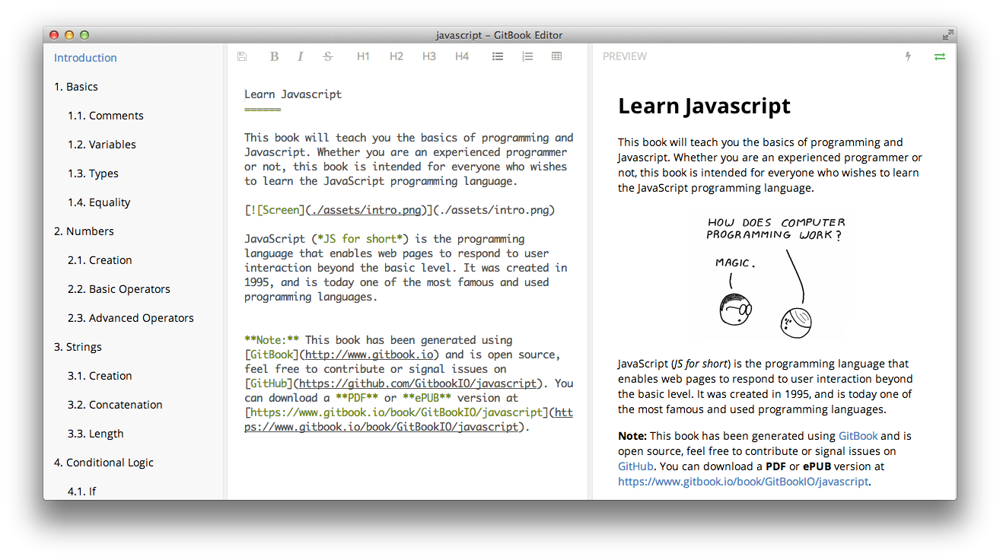
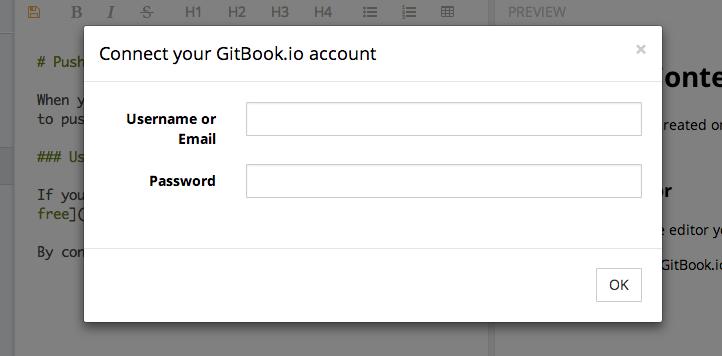

# Editor

Un editor está disponible para el escritorio. Es de código abierto y el código fuente está disponible en [GitHub](https://github.com/GitbookIO/editor).

### Descarga

El editor está disponible para [descargar](https://www.gitbook.io/editor/download) para estas plataformas:

* [Windows](https://www.gitbook.io/editor/download/win)
* [Mac OS](https://www.gitbook.io/editor/download/mac)
* [Linux 32bits](https://www.gitbook.io/editor/download/linux32)
* [Linux 64bits](https://www.gitbook.io/editor/download/linux64)

### Conecte su cuenta GitBook.io

Usted puede conectar fácilmente su cuenta GitBook.io introduciendo su nombre de usuario y contraseña en el cuadro de diálogo de autenticación:

